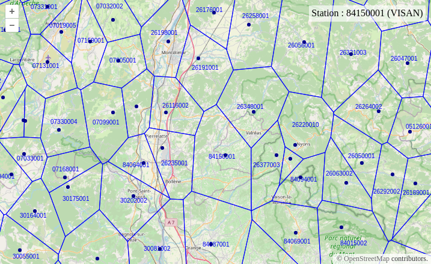

# Stations Météo-France Voronoi

Cette application calcule et affiche les cellules de Vonoroï à partir des [Informations sur les stations (métadonnées)](https://www.data.gouv.fr/fr/datasets/informations-sur-les-stations-metadonnees/) de Météo-France récupérées au format GeoJSON. Cela permet de partitionner le territoire de manière à toujours avoir une station à une position donnée.

La carte est construite avec [Openlayers](https://openlayers.org/) et affiche un fond de plan OSM, la couche des cellules et la couche des stations.

> **NOTE :**
> La version 7+ de [turf](https://turfjs.org/) est utilisée bien qu'étant en version alpha à l'écriture de ces lignes car elle permet de récupérer les attributs par défaut.

L'application est compilée avec [Yarn](https://yarnpkg.com/) et [Vite](https://vitejs.dev/).

.

## Récupération de la dernière version des stations

```sh
curl -o data/stations-meteo.geojson https://donneespubliques.meteofrance.fr/metadonnees_publiques/fiches/fiches.json
```

## Développement

Installer les dépendances :
```sh
# Dernières versions
yarn

# Ou telles quelles
yarn install --frozen-lockfile
```

Démarrer en local :
```sh
yarn start
```

Ouvrir http://localhost:5173/.

## Construction

Construire l'application et copier le jeu de données :
```sh
yarn build
cp -r data dist/data
```

Il s'agit ensuite de servir en HTTP le contenu du répertoire `dist`.

## Remarques

Le calcul des cellules n'est nécessaire qu'en cas de changement.

Le serveur `donneespubliques.meteofrance.fr` n'accepte pas les requêtes cross-domain sans quoi nous aurions pu consommer directement le fichier geojson fourni afin d'avoir une synchronisation parfaite avec des données associées le cas échéant (ex : prévisions météo).
